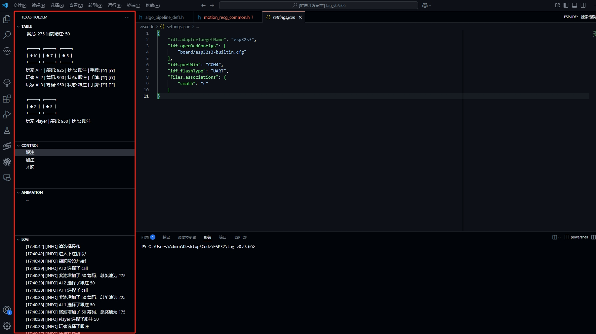

# Texas Holdem Extension
# 德州扑克扩展

This is a Visual Studio Code extension that allows users to play a simple Texas Holdem game directly within the editor.
这是一个 Visual Studio Code 扩展，允许用户直接在编辑器中玩简单的德州扑克游戏。



## Features
## 功能

- Start a Texas Holdem game from the sidebar.
  从侧边栏启动德州扑克游戏。
- Interactive game interface with user-friendly controls.
  交互式游戏界面，提供用户友好的控制。
- Basic game logic implemented for a fun experience.
  实现了基本的游戏逻辑，带来有趣的体验。
- AI players with decision-making logic based on hand strength and game state.
  AI 玩家基于手牌强度和游戏状态的决策逻辑。
- Visual representation of the game table, including community cards, player hands, and pot size.
  游戏桌的可视化展示，包括公共牌、玩家手牌和底池大小。
- Logging system to track game events and player actions.
  日志系统，用于跟踪游戏事件和玩家操作。
- Animation effects for card dealing and dealer selection.
  卡牌发牌和庄家选择的动画效果。

## Installation
## 安装

1. Clone the repository or download the ZIP file.
   克隆此仓库或下载 ZIP 文件。
2. Open the project in Visual Studio Code.
   在 Visual Studio Code 中打开项目。
3. Run the following command to install dependencies:
   运行以下命令安装依赖项：

   ```
   npm install
   ```

4. Compile the TypeScript files:
   编译 TypeScript 文件：

   ```
   npm run compile
   ```

5. Open the extension in the debugger or package it for distribution.
   在调试器中打开扩展或将其打包以供分发。

## Usage
## 使用方法

- After installation, you will see a Texas Holdem icon in the sidebar.
  安装后，您将在侧边栏看到一个德州扑克图标。
- Click the icon to start the game.
  点击图标以启动游戏。
- Follow the on-screen instructions to play.
  按照屏幕上的指示进行游戏。
- Use the sidebar controls to perform actions like "Call," "Raise," or "Fold."
  使用侧边栏控件执行操作，例如“跟注(Call)”、“加注(Raise)”或“弃牌(Fold)”。

## Current Development Goals
## 当前开发目标

- **Enhance AI Logic**: Improve the decision-making process for AI players to make them more competitive and realistic.
  **增强 AI 逻辑**：改进 AI 玩家决策过程，使其更具竞争力和现实感。
- **Improve UI/UX**: Add more intuitive controls and better visual feedback for player actions and game progress.
  **改进 UI/UX**：添加更直观的控件和更好的视觉反馈，以显示玩家操作和游戏进度。
- **Multiplayer Support**: Enable multiple users to join the same game session.
  **支持多人游戏**：允许多个用户加入同一游戏会话。
- **Save and Load Games**: Implement functionality to save the game state and resume later.
  **保存和加载游戏**：实现保存游戏状态并稍后恢复的功能。
- **Customizable Settings**: Allow users to configure game rules, starting chips, and AI difficulty.
  **自定义设置**：允许用户配置游戏规则、起始筹码和 AI 难度。

## Known Issues
## 已知问题

- **AI Behavior**: AI players sometimes make suboptimal decisions in edge cases.
  **AI 行为**：AI 玩家在某些边界情况下可能会做出次优决策。
- **Animation Performance**: Card dealing animations may lag on slower machines.
  **动画性能**：在较慢的机器上，发牌动画可能会出现卡顿。
- **Error Handling**: Limited error handling for edge cases like empty decks or invalid game states.
  **错误处理**：对空牌堆或无效游戏状态等边界情况的错误处理有限。

## Future Plans
## 未来计划

- **Online Multiplayer**: Add support for online multiplayer games with real-time updates.
  **在线多人游戏**：添加对实时更新的在线多人游戏的支持。
- **Advanced Statistics**: Provide detailed game statistics and player performance metrics.
  **高级统计**：提供详细的游戏统计数据和玩家表现指标。
- **Custom Themes**: Allow users to customize the game table and card designs.
  **自定义主题**：允许用户自定义游戏桌面和卡牌设计。
- **Mobile Compatibility**: Explore the possibility of extending the game to mobile platforms.
  **移动兼容性**：探索将游戏扩展到移动平台的可能性。

## Contributing
## 贡献

To contribute to this project:
如果您想为此项目做出贡献：

1. Fork the repository.
   Fork 此仓库。
2. Create a new branch for your feature or bug fix.
   为您的功能或错误修复创建一个新分支。
3. Submit a pull request with your changes.
   提交包含您更改的 Pull Request。

## Contact
## 联系方式

For questions, suggestions, or bug reports, please contact:
如有问题、建议或错误报告，请联系：

- **Email**: matreshka999@icloud.com
  **电子邮件**：matreshka999@icloud.com
- **GitHub Issues**: [Submit an issue](https://github.com/your-repo/texas-holdem/issues)
  **GitHub 问题**：[提交问题](https://github.com/your-repo/texas-holdem/issues)

## License
## 许可证

This project is licensed under the MIT License. See the LICENSE file for details.
此项目基于 MIT 许可证授权。有关详细信息，请参阅 LICENSE 文件。